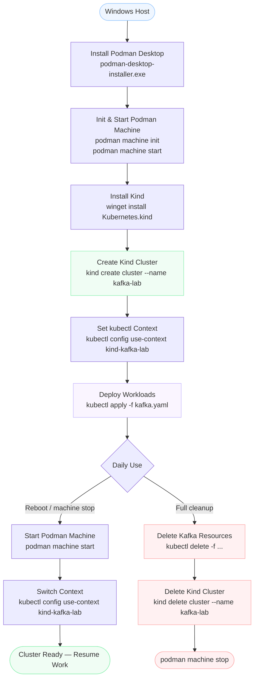

# Podman Desktop — Install, Kubernetes Cluster Setup & Management

Step-by-step guide to install **Podman Desktop** on Windows, create a local **Kubernetes cluster using Kind**, and manage it with `kubectl`.

> This guide is a companion to [README.md](README.md) which covers deploying Kafka on Kubernetes.
> For a richer visual reference, open [podman-kubernetes-flowchart.html](podman-kubernetes-flowchart.html) in your browser.

---

## Overview Flowchart



### Component Architecture

```
Windows Host
├── Podman Desktop          (GUI only — quitting stops nothing)
└── Podman Machine (WSL2)   (podman machine start/stop)
    └── Kind Cluster: kafka-lab   (kind create/delete cluster)
        └── Namespace: kafka      (kubectl create namespace kafka)
            ├── Strimzi Operator
            ├── Kafka Cluster (my-cluster)
            ├── Kafka UI
            └── KafkaTopic (my-topic)
```

---

## Prerequisites

- Windows 10/11 with WSL2 enabled
- PowerShell or Command Prompt
- Internet connection

---

## Part 1: Install Podman Desktop

### Step 1 — Download Podman Desktop

Go to: **https://podman-desktop.io/downloads**

Click **"Windows"** and download the `.exe` installer.

### Step 2 — Run the Installer

Double-click the downloaded `.exe` and follow the setup wizard.

The installer will set up:
- Podman Desktop (GUI application)
- Podman CLI (`podman`)
- WSL2 integration

### Step 3 — Open a New Terminal and Verify

> ⚠️ **Important:** Always open a **new** PowerShell/cmd window after install so the updated PATH takes effect.

```powershell
podman --version
```

Expected output:
```
podman version 5.x.x
```

### Step 4 — Initialize and Start the Podman Machine

Podman on Windows runs containers inside a lightweight WSL2 VM called a "machine".

```powershell
podman machine init
podman machine start
```

Check the machine status:

```powershell
podman machine list
```

Expected output:
```
NAME                     VM TYPE   CREATED      LAST UP     CPUS  MEMORY  DISK SIZE
podman-machine-default   wsl       x mins ago   Currently running   ...
```

> **Note:** If you see `already running` when starting — that's fine, the machine is up.

---

## Part 2: Install `kind` (Kubernetes in Docker/Podman)

Kind creates local Kubernetes clusters using containers as nodes.

### Step 1 — Install Kind via winget

```powershell
winget install Kubernetes.kind
```

### Step 2 — Open a new terminal and verify

```powershell
kind --version
```

Expected output:
```
kind v0.x.x go1.x.x windows/amd64
```

---

## Part 3: Create a Kubernetes Cluster

### Step 1 — Create a Kind cluster using Podman as the provider

```powershell
$env:KIND_EXPERIMENTAL_PROVIDER = "podman"
kind create cluster --name kafka-lab
```

> ⏳ This takes 1–3 minutes. Kind pulls the node image and configures the cluster.

Expected output:
```
Creating cluster "kafka-lab" ...
 ✓ Ensuring node image (kindest/node:v1.x.x) 🖼
 ✓ Preparing nodes 📦
 ✓ Writing configuration 📜
 ✓ Starting control-plane 🕹️
 ✓ Installing CNI 🔌
 ✓ Installing StorageClass 💾
Set kubectl context to "kind-kafka-lab"
You can now use your cluster with:
kubectl cluster-info --context kind-kafka-lab
```

### Step 2 — Verify the cluster is ready

```powershell
kubectl get nodes
```

Expected output:
```
NAME                      STATUS   ROLES           AGE   VERSION
kafka-lab-control-plane   Ready    control-plane   2m    v1.36.x
```

### Step 3 — Create the kafka namespace

Use the namespace resource file (recommended over `kubectl create namespace`):

```powershell
kubectl apply -f kafka-namespace.yaml
```

Verify:

```powershell
kubectl get namespace kafka
```

Expected output:
```
NAME    STATUS   AGE
kafka   Active   5s
```

---

## Part 4: Manage the Kubernetes Cluster

### Switch Between Clusters (Contexts)

If you have multiple clusters (e.g., AKS + Kind), use contexts to switch between them.

List all available contexts:

```powershell
kubectl config get-contexts
```

Switch to your Kind cluster:

```powershell
kubectl config use-context kind-kafka-lab
```

Check the current active context:

```powershell
kubectl config current-context
```

---

### Namespaces

List all namespaces:

```powershell
kubectl get namespaces
```

Create a new namespace:

```powershell
kubectl create namespace my-namespace
```

Delete a namespace (removes everything inside it):

```powershell
kubectl delete namespace my-namespace
```

Set a default namespace for the current context (so you don't need `-n <namespace>` on every command):

```powershell
kubectl config set-context --current --namespace=kafka
```

Verify the default namespace is set:

```powershell
kubectl config view --minify | Select-String namespace
```

Reset back to no default namespace:

```powershell
kubectl config set-context --current --namespace=
```

---

### Pods

List all pods in all namespaces:

```powershell
kubectl get pods -A
```

List pods in a specific namespace:

```powershell
kubectl get pods -n <namespace>
```

Describe a pod (events, resource limits, status):

```powershell
kubectl describe pod <pod-name> -n <namespace>
```

View pod logs:

```powershell
kubectl logs <pod-name> -n <namespace>
```

Follow logs in real time:

```powershell
kubectl logs -f <pod-name> -n <namespace>
```

Execute a command inside a pod:

```powershell
kubectl exec -it <pod-name> -n <namespace> -- /bin/bash
```

---

### Deployments

List deployments:

```powershell
kubectl get deployments -n <namespace>
```

Scale a deployment:

```powershell
kubectl scale deployment <name> --replicas=3 -n <namespace>
```

Restart a deployment (rolling restart):

```powershell
kubectl rollout restart deployment/<name> -n <namespace>
```

---

### Services

List services:

```powershell
kubectl get svc -n <namespace>
```

Port-forward a service to your local machine:

```powershell
kubectl port-forward svc/<service-name> <local-port>:<service-port> -n <namespace>
```

Example — access Kafka UI locally:

```powershell
kubectl port-forward svc/kafka-ui 8080:8080 -n kafka
```

Then open: **http://localhost:8080**

> 💡 `port-forward` is the recommended way to access services on Kind + Podman.
> `LoadBalancer` type does **not** auto-assign IPs on local Kind clusters.

---

### Persistent Volumes

List Persistent Volume Claims:

```powershell
kubectl get pvc -n <namespace>
```

Kind automatically installs a `standard` StorageClass backed by the host filesystem, so PVCs are provisioned automatically.

Verify the default StorageClass:

```powershell
kubectl get storageclass
```

Expected output:
```
NAME                 PROVISIONER             RECLAIMPOLICY   VOLUMEBINDINGMODE
standard (default)   rancher.io/local-path   Delete          WaitForFirstConsumer
```

---

## Part 5: Podman Desktop, Podman Machine and Kind — Lifecycle

### How They Relate

Podman Desktop is just a GUI frontend. The Podman machine and Kind cluster run independently underneath it:

```
Windows Host
├── Podman Desktop        (UI only — quitting stops nothing)
└── Podman Machine (WSL2 VM)   ← Podman CLI talks to this
    ├── Image Store       (kindest/node image stored here)
    └── Kind Cluster: kafka-lab   (node runs as a container)
        └── Kind Node Container
            ├── containerd  (pulls workload images inside here)
            └── Namespace: kafka
                ├── Strimzi Operator image
                ├── Kafka image
                └── Kafka UI image
```

### What Podman Desktop Manages

| Component | Managed by Podman Desktop? | Behaviour when Podman Desktop is quit |
|-----------|---------------------------|---------------------------------------|
| **Podman machine** (WSL2 VM) | ✅ Yes (via UI) | Machine **keeps running** in background |
| **Kind cluster** | ❌ No | Cluster **keeps running** — Podman Desktop has no control over it |

> 💡 **Quitting Podman Desktop stops nothing.** Everything keeps running as background processes.

### Where to Run Commands

Podman CLI is installed on **Windows**, not inside WSL. Always run `podman`, `kind`, and `kubectl` from PowerShell or cmd — never from the WSL terminal.

| Terminal | `podman` | `kubectl` | `kind` |
|----------|----------|-----------|--------|
| **PowerShell / cmd (Windows)** | ✅ Yes | ✅ Yes | ✅ Yes |
| **WSL2 shell (Ubuntu)** | ❌ No — wrong side | ✅ If installed | ❌ No |

> If you open a WSL terminal and run `podman`, you will get `Command 'podman' not found`. This is expected — the Podman CLI lives on the Windows side, not inside the VM.

### Where Container Images Are Downloaded

When you deploy workloads to the Kind cluster, images are **not** downloaded to the Windows filesystem directly. There are two levels:

| Level | What is stored | Where |
|-------|---------------|-------|
| **Level 1 — Podman Machine** | `kindest/node` image (the cluster node itself) | Inside WSL2 VM image store |
| **Level 2 — Kind Node Container** | Workload images (Strimzi, Kafka, Kafka UI) | Inside the Kind node, pulled by `containerd` |

The Windows filesystem only holds the WSL2 virtual disk file (`.vhdx`) — all container data lives inside it.

Check the Kind node container running in Podman:

```powershell
podman ps
```

Check images pulled inside the Kind node:

```powershell
kubectl get pods -n kafka -o jsonpath="{..image}" | ForEach-Object { $_ -split " " } | Sort-Object -Unique
```

> ⚠️ **If you run `kind delete cluster`**, the Kind node container is deleted and all workload images inside it are lost. They will be re-pulled from the internet on next deploy.

### Lifecycle at a Glance

| Action | Podman Machine | Kind Cluster | Workload Images | Kafka Workloads |
|--------|---------------|--------------|-----------------|-----------------|
| Quit Podman Desktop | ✅ Running | ✅ Running | ✅ Intact | ✅ Running |
| `podman machine stop` | ⛔ Stopped | ⛔ Suspended | ✅ Intact | ⛔ Suspended |
| `podman machine start` | ✅ Running | ✅ Resumes | ✅ Intact | ✅ Resumes |
| `kind delete cluster` | ✅ Running | ❌ Deleted | ❌ Deleted | ❌ Deleted |
| Windows reboot | ⛔ Stopped | ⛔ Suspended | ✅ Intact | ⛔ Suspended |

### Stop the Podman Machine (suspends everything)

```powershell
podman machine stop
```

### Restart the Podman Machine (resumes everything)

```powershell
podman machine start
```

> ✅ Kind clusters **persist** across Podman machine restarts and Windows reboots. You only need to run `kind create cluster` once. Simply start the machine and your cluster will be available again.

### After a Windows Reboot

The Podman machine stops on reboot. Just start it again — your Kind cluster and all workloads resume automatically:

```powershell
podman machine start
kubectl config use-context kind-kafka-lab
kubectl get nodes
```

### Delete the Kind Cluster

```powershell
kind delete cluster --name kafka-lab
```

### Delete All Kind Clusters

```powershell
kind delete clusters --all
```

---

## Part 6: Podman Desktop UI — Kubernetes Features

Podman Desktop provides a GUI to manage your cluster visually:

| Feature | Location in UI |
|---------|----------------|
| View running pods | **Containers** tab |
| Create Kind cluster | **Kind** section in left sidebar |
| Switch Kubernetes context | **Kubernetes** section → context dropdown |
| View cluster resources | **Kubernetes** → Pods / Deployments / Services |
| Check resource usage | **Dashboard** tab |

---

## Useful One-Liners

```powershell
# Check everything in a namespace
kubectl get all -n kafka

# Watch pods in real time
kubectl get pods -n kafka -w

# Get events (useful for debugging)
kubectl get events -n kafka --sort-by='.lastTimestamp'

# Check resource usage (requires metrics-server)
kubectl top pods -n kafka

# View full cluster info
kubectl cluster-info
```

---

## Troubleshooting

| Problem | Fix |
|---------|-----|
| `podman` not recognized in PowerShell | Open a new terminal after install |
| `podman` not found inside WSL terminal | Expected — run `podman` from PowerShell/cmd, not WSL |
| `kind` not recognized | Open a new terminal after `winget install` |
| Podman machine won't start | Run `podman machine init` first |
| `LoadBalancer` service stuck in `<pending>` | Use `kubectl port-forward` instead |
| Kind cluster not reachable after reboot | Run `podman machine start` then `kubectl config use-context kind-kafka-lab` |
| Wrong kubectl context | Run `kubectl config use-context kind-kafka-lab` |
| Images re-downloaded after cluster recreate | Expected — `kind delete cluster` removes the Kind node and its images |

---

## References

- [Podman Desktop](https://podman-desktop.io/)
- [Kind Documentation](https://kind.sigs.k8s.io/)
- [kubectl Cheat Sheet](https://kubernetes.io/docs/reference/kubectl/cheatsheet/)
- [Podman Documentation](https://docs.podman.io/)
- [Kafka on Kubernetes → README.md](README.md)
